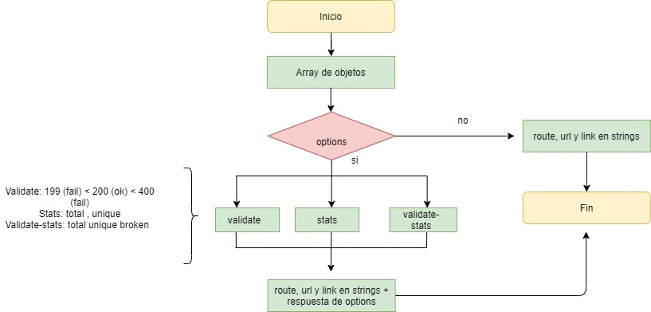
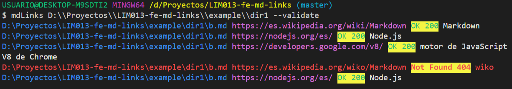
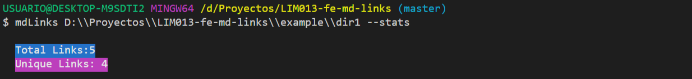
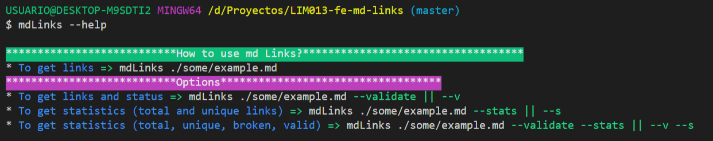

# Markdown Links
## Resumen 📚
Es una librería que te permite extraer links de archivos md. De igual modo tambíen permite acceder a estadisticas como cantidad de links totales, únicos, válidos y rotos.
## Índice

* [1. Diagrama de flujo](#1-diagrama-de-flujo)
* [2. Instalación](#2-instalación)
* [3. Uso de mdLinks](#3-uso-de-mdLinks)
* [4. Objetivos de aprendizaje](#4-objetivos-de-aprendizaje)
* [5. Pistas, tips y lecturas complementarias](#5-pistas-tips-y-lecturas-complementarias)
* [6. Checklist](#6-checklist)

***

## 1. Diagrama de flujo 📝

### 1. Api


### 2. Cli



***

### 2. Instalación 💻💿

- Instalar la libreria via `npm install fran-mdlinks`

~~~
npm install fran-mdlinks
~~~

***
## 3. Uso de la mdLinks ⚙️

### Detalles de la Api 

`mdLinks(path, options)`

##### Argumentos

* `path`: Ruta absoluta o relativa al archivo o directorio. Si la ruta pasada es
  relativa, debe resolverse como relativa al directorio desde donde se invoca
  node - _current working directory_).
* `options`: Un objeto con las siguientes propiedades:
  

##### Valor de retorno

* `href`: URL encontrada.
* `text`: Texto que aparecía dentro del link (`<a>`).
* `file`: Ruta del archivo donde se encontró el link.

##### Ejemplo

```js
const mdLinks = require("md-links");

mdLinks("./some/example.md")
  .then(links => {
    // => [{ href, text, file }]
  })
  .catch(console.error);

mdLinks("./some/example.md", { validate: true })
  .then(links => {
    // => [{ href, text, file, status, message }]
  })
  .catch(console.error);

mdLinks("./some/dir")
  .then(links => {
    // => [{ href, text, file }]
  })
  .catch(console.error);
```

### CLI (Command Line Interface - Interfaz de Línea de Comando)
Ejecutar la aplicación en la terminal.

#### 1. `md-links <path-to-file>`
Retorna listado de links.


#### 2. `md-links <path-to-file> [options]`
Retorna estadisticas de acuerdo a la opción ingresada:

##### `md-links <path-to-file> --validate`
Verifica el funcionamiento de cada link. 



##### `md-links <path-to-file> --stats`
Retorna un texto con estadísticas básicas sobre los links.



##### `md-links <path-to-file> --validate --stats`
Retorna estadísticas que necesitan de los resultados de la validación.


#### 3. `md-links --help`
Muestra una guía básica.




## 4. Objetivos de aprendizaje 🤓

Diseñar tu propia librería es una experiencia fundamental para cualquier
desarrollador porque que te obliga a pensar en la interfaz (API) de tus
_módulos_ y cómo será usado por otros developers. Debes tener especial
consideración en peculiaridades del lenguaje, convenciones y buenas prácticas.

A continuación puedes ver los objetivos de aprendizaje de este proyecto:

### JavaScript

* [x] Uso de condicionales (if-else | switch | operador ternario)
* [x] Uso de funciones (parámetros | argumentos | valor de retorno)
* [x] Manipular arrays (filter | map | sort | reduce)
* [x] Manipular objects (key | value)
* [x] Uso ES modules ([`import`](https://developer.mozilla.org/en-US/docs/Web/JavaScript/Reference/Statements/import)
| [`export`](https://developer.mozilla.org/en-US/docs/Web/JavaScript/Reference/Statements/export))
* [x] Diferenciar entre expression y statements.
* [x] Diferenciar entre tipos de datos atómicos y estructurados.
* [x] [Uso de callbacks.](https://developer.mozilla.org/es/docs/Glossary/Callback_function)
* [x] [Consumo de Promesas.](https://scotch.io/tutorials/javascript-promises-for-dummies#toc-consuming-promises)
* [x] [Creación de Promesas.](https://www.freecodecamp.org/news/how-to-write-a-javascript-promise-4ed8d44292b8/)

### Node

* [x] Uso de sistema de archivos. ([fs](https://nodejs.org/api/fs.html), [path](https://nodejs.org/api/path.html))
* [x] Instalar y usar módulos. ([npm](https://www.npmjs.com/))
* [x] Creación de modules. [(CommonJS)](https://nodejs.org/docs/latest-v0.10.x/api/modules.html)
* [x] [Configuración de package.json.](https://docs.npmjs.com/files/package.json)
* [x] [Configuración de npm-scripts](https://docs.npmjs.com/misc/scripts)
* [x] Uso de CLI (Command Line Interface - Interfaz de Línea de Comando)

### Testing

* [x] [Testeo unitario.](https://jestjs.io/docs/es-ES/getting-started)
* [x] [Testeo asíncrono.](https://jestjs.io/docs/es-ES/asynchronous)
* [x] [Uso de librerias de Mock.](https://jestjs.io/docs/es-ES/manual-mocks)
* [x] Uso de Mocks manuales.
* [x] Testeo para múltiples Sistemas Operativos.

### Estructura del código y guía de estilo

* [x] Organizar y dividir el código en módulos (Modularización)
* [x] Uso de identificadores descriptivos (Nomenclatura | Semántica)
* [x] Uso de linter (ESLINT)

### Git y GitHub

* [x] Uso de comandos de git (add | commit | pull | status | push)
* [x] Manejo de repositorios de GitHub (clone | fork | gh-pages)
* [x] Colaboración en Github (branches | pull requests | |tags)
* [x] Organización en Github (projects | issues | labels | milestones)

### HTTP

* [x] Verbos HTTP ([http.get](https://nodejs.org/api/http.html#http_http_get_options_callback))

### Fundamentos de programación

* [x] [Recursión.](https://www.youtube.com/watch?v=lPPgY3HLlhQ)

***

## 5. Pistas, tips y lecturas complementarias 

### FAQs

#### 쮺칩mo hago para que mi módulo sea _instalable_ desde GitHub?

Para que el módulo sea instalable desde GitHub solo tiene que:

* Estar en un repo público de GitHub
* Contener un `package.json` válido

Con el comando `npm install githubname/reponame` podemos instalar directamente
desde GitHub. Ver [docs oficiales de `npm install` acá](https://docs.npmjs.com/cli/install).

Por ejemplo, el [`course-parser`](https://github.com/Laboratoria/course-parser)
que usamos para la currícula no está publicado en el registro público de NPM,
así que lo instalamos directamente desde GitHub con el comando `npm install
Laboratoria/course-parser`.

### Sugerencias de implementación

La implementación de este proyecto tiene varias partes: leer del sistema de
archivos, recibir argumentos a través de la línea de comando, analizar texto,
hacer consultas HTTP, ... y todas estas cosas pueden enfocarse de muchas formas,
tanto usando librerías como implementando en VanillaJS.

Por poner un ejemplo, el _parseado_ (análisis) del markdown para extraer los
links podría plantearse de las siguientes maneras (todas válidas):

* Usando un _módulo_ como [markdown-it](https://github.com/markdown-it/markdown-it),
  que nos devuelve un arreglo de _tokens_ que podemos recorrer para identificar
  los links.
* Siguiendo otro camino completamente, podríamos usar
  [expresiones regulares (`RegExp`)](https://developer.mozilla.org/es/docs/Web/JavaScript/Guide/Regular_Expressions).
* También podríamos usar una combinación de varios _módulos_ (podría ser válido
  transformar el markdown a HTML usando algo como [marked](https://github.com/markedjs/marked)
  y de ahí extraer los link con una librería de DOM como [JSDOM](https://github.com/jsdom/jsdom)
  o [Cheerio](https://github.com/cheeriojs/cheerio) entre otras).
* Usando un _custom renderer_ de [marked](https://github.com/markedjs/marked)
  (`new marked.Renderer()`).

No dudes en consultar a tus compañeras, coaches y/o el [foro de la comunidad](http://community.laboratoria.la/c/js)
si tienes dudas existenciales con respecto a estas decisiones. No existe una
"única" manera correcta :wink:

### Tutoriales / NodeSchool workshoppers

* [learnyounode](https://github.com/workshopper/learnyounode)
* [how-to-npm](https://github.com/workshopper/how-to-npm)
* [promise-it-wont-hurt](https://github.com/stevekane/promise-it-wont-hurt)

### Otros recursos

* [Acerca de Node.js - Documentación oficial](https://nodejs.org/es/about/)
* [Node.js file system - Documentación oficial](https://nodejs.org/api/fs.html)
* [Node.js http.get - Documentación oficial](https://nodejs.org/api/http.html#http_http_get_options_callback)
* [Node.js - Wikipedia](https://es.wikipedia.org/wiki/Node.js)
* [What exactly is Node.js? - freeCodeCamp](https://medium.freecodecamp.org/what-exactly-is-node-js-ae36e97449f5)
* [쯈ué es Node.js y para qué sirve? - drauta.com](https://www.drauta.com/que-es-nodejs-y-para-que-sirve)
* [쯈ué es Nodejs? Javascript en el Servidor - Fazt en YouTube](https://www.youtube.com/watch?v=WgSc1nv_4Gw)
* [쯉implemente qué es Node.js? - IBM Developer Works, 2011](https://www.ibm.com/developerworks/ssa/opensource/library/os-nodejs/index.html)
* [Node.js y npm](https://www.genbeta.com/desarrollo/node-js-y-npm)
* [Módulos, librerías, paquetes, frameworks... 쯖uál es la diferencia?](http://community.laboratoria.la/t/modulos-librerias-paquetes-frameworks-cual-es-la-diferencia/175)
* [Asíncronía en js](https://carlosazaustre.es/manejando-la-asincronia-en-javascript)
* [NPM](https://docs.npmjs.com/getting-started/what-is-npm)
* [Publicar packpage](https://docs.npmjs.com/getting-started/publishing-npm-packages)
* [Crear módulos en Node.js](https://docs.npmjs.com/getting-started/publishing-npm-packages)
* [Leer un archivo](https://nodejs.org/api/fs.html#fs_fs_readfile_path_options_callback)
* [Leer un directorio](https://nodejs.org/api/fs.html#fs_fs_readdir_path_options_callback)
* [Path](https://nodejs.org/api/path.html)
* [Linea de comando CLI](https://medium.com/netscape/a-guide-to-create-a-nodejs-command-line-package-c2166ad0452e)
- [Promise](https://javascript.info/promise-basics)
- [Comprendiendo Promesas en Js](https://hackernoon.com/understanding-promises-in-javascript-13d99df067c1)
- [Pill de recursión - video](https://www.youtube.com/watch?v=lPPgY3HLlhQ&t=916s)
- [Pill de recursión - repositorio](https://github.com/merunga/pildora-recursion)

## 8. Checklist

### General

* [ ] Puede instalarse via `npm install --global <github-user>/md-links`

### `README.md`

* [ ] Un board con el backlog para la implementación de la librería.
* [ ] Documentación técnica de la librería.
* [ ] Guía de uso e instalación de la librería

### API `mdLinks(path, opts)`

* [✅] El módulo exporta una función con la interfaz (API) esperada.
* [✅] Implementa soporte para archivo individual
* [✅] Implementa soporte para directorios
* [✅] Implementa `options.validate`

### CLI

* [✅] Expone ejecutable `md-links` en el path (configurado en `package.json`)
* [✅] Se ejecuta sin errores / output esperado
* [✅] Implementa `--validate`
* [✅] Implementa `--stats`

### Pruebas / tests

* [✅] Pruebas unitarias cubren un mínimo del 70% de statements, functions,
  lines, y branches.
* [✅] Pasa tests (y linters) (`npm test`).
